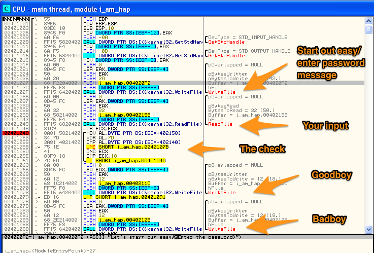

# Flare-On Challenge #1
#### By: Sage

On the flare-on website you download the challenge. The filename was *Flare-On_start_2015.exe* and after accepting the EULA the filename *i_am_happy_you_are_to_playing_the_flareon_challenge.exe* is created.

Ollydbg shows it to be a very simple program. You can get the gist of it just looking at the API calls. It prints out a message, waits for your input, and if the input was correct the check loop will finish giving you the goodboy message. If you enter wrong input then the JNZ instruction at `0x40105B` will take you to the badboy message. An annotated image of the code is below.



The loop appears to be evaluating one character at a time, hence the references to register **AL**. A breakpoint at `0x0040104D` will let OllyDbg do the calculation of `[ECX+402158]` for you; revealing to you that this line takes one character of your input at a time. Next an XOR is done between your input and 0x7D; you go to the badboy message if it doesn't match what the executable had in mind.

So no problem, if A ^ B = C then C ^ B = A; that is how you reverse an XOR. In this case A is your input, B is 0x7D, and C is what the executable had in mind. We know B, as for C it is pointed to on `0x401055` by `[ECX+402140]`. Let Ollydbg do the calculations for you once again, then follow that location in the dump pane and extract the bytes until you hit a NULL character (0x00).

Lastly, we write a script that does C ^ B to reverse the algorithm. The script I wrote is below. The variable named extracted is what `[ECX+402140]` pointed to on `0x401055`.

```python
#!/usr/bin/python

extracted="1F 08 13 13 04 22 0E 11 4D 0D 18 3D 1B 11 1C 0F 18 50 12 13 53 1E 12 10 40 0D 0A"
xored = [int(c, 16) ^ 0x7D for c in extracted.split()]
asciied = map(chr,xored)
print ''.join(asciied)
```
The output of the script is bunny_sl0pe@flare-on.com=pw and naturally we just remove the "=pw" and we have our email address.
