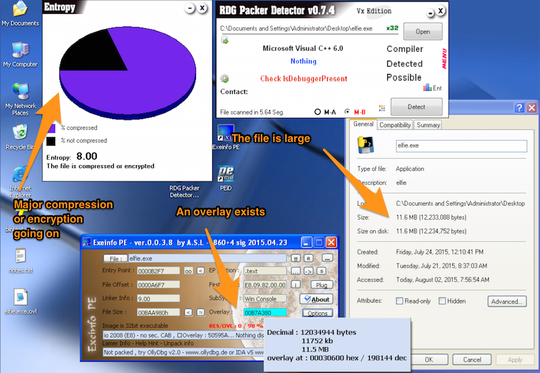
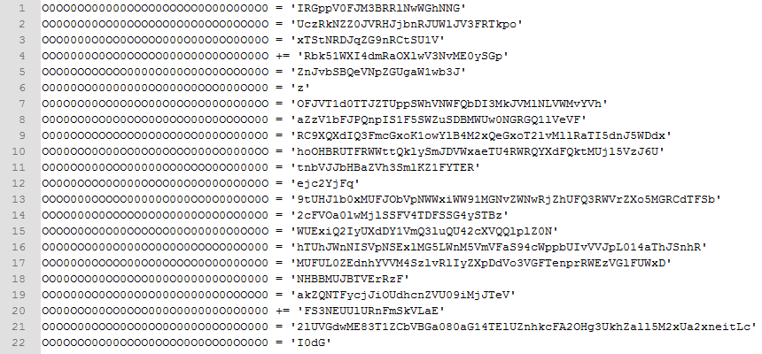

# Flare-On Challenge #3
#### By: Sage

This challenge was very similar to a [challenge](https://github.com/keyboardsage/papers/raw/master/Write-ups/HackIM%202015/Reversing_100.pdf) in [Nullcon's HackIM 2015](https://ctftime.org/event/186). 

The PE Scanner RDG Packer Detector says that there is a lot of compression/encryption associated with the file. The PE Scanner ExeInfo PE says that there is an overlay present in the file. Using ExeInfo PE's overlay menu save the overlay, resulting in elfie.exe-ovl. I renamed the file elfie.exe.ovl simply out of personal preference. A screenshot of this is below.



When you open the overlay file in Notepad++ you see PYZ right at the beginning. This is a big red flag because these are the characters found in a Python Zipped Executable (PYZ) file. If this is your first rodeo with a PYZ file, the most important thing to know is that they are used when Python scripts are turned into native executables. It is a type of archive file that contains the Python interpreter and your code. When you run the executable the data is extracted to a temporary folder and the Python program is executed.

To dive into the file we need two tools, archive_viewer.py and pyinstxtractor.py. You can acquire both of these tools from links in this [sysforensics.org](http://www.sysforensics.org/2015/04/unpacking-pyinstaller-packed-python-malware/) article. Using archive_viewer.py we can view what is inside the PYZ file as seen below.

```
(pyi-env-name) C:\Documents and Settings\Administrator\Desktop>archive_viewer.py elfie.exe.ovl
 pos, length, uncompressed, iscompressed, type, name
[(0, 995801, 995801, 0, 'z', 'out00-PYZ.pyz'),
 (995801, 169, 234, 1, 'm', 'struct'),
 (995970, 1128, 2445, 1, 'm', 'pyi_os_path'),
 (997098, 4767, 12159, 1, 'm', 'pyi_archive'),
 (1001865, 3937, 12882, 1, 'm', 'pyi_importers'),
 (1005802, 1800, 4228, 1, 's', '_pyi_bootstrap'),
 (1007602, 4173, 13142, 1, 's', 'pyi_carchive'),
 (1011775, 1498339, 4053576, 1, 's', 'elfie'),
 (2510114, 602, 1857, 1, 'b', 'Microsoft.VC90.CRT.manifest'),
 (2510716, 317595, 655872, 1, 'b', 'msvcr90.dll'),
 (2828311, 155722, 568832, 1, 'b', 'msvcp90.dll'),
 (2984033, 66835, 224768, 1, 'b', 'msvcm90.dll'),
 (3050868, 1132742, 2449920, 1, 'b', 'python27.dll'),
 (4183610, 5428, 10240, 1, 'b', 'select.pyd'),
 (4189038, 257306, 686080, 1, 'b', 'unicodedata.pyd'),
 (4446344, 512232, 1853440, 1, 'b', 'PySide.QtCore.pyd'),
 (4958576, 173921, 358400, 1, 'b', '_hashlib.pyd'),
 (5132497, 34832, 68608, 1, 'b', 'bz2.pyd'),
 (5167329, 443763, 899584, 1, 'b', '_ssl.pyd'),
 (5611092, 1675208, 6947328, 1, 'b', 'PySide.QtGui.pyd'),
 (7286300, 21314, 44544, 1, 'b', '_socket.pyd'),
 (7307614, 47340, 110592, 1, 'b', 'pyside-python2.7.dll'),
 (7354954, 44914, 108544, 1, 'b', 'shiboken-python2.7.dll'),
 (7399868, 1026088, 2554880, 1, 'b', 'QtCore4.dll'),
 (8425956, 3607678, 8360448, 1, 'b', 'QtGui4.dll'),
 (12033634, 262, 472, 1, 'b', 'elfie.exe.manifest')]
```

Now we need to extract those files. We can do it with archive_viewer but it is easier with pyinstxtractor.py. The below command will extract the PYZ.

```
C:\Documents and Settings\Administrator\Desktop>pyinstxtractor.py elfie.exe
Successfully extracted Pyinstaller archive : elfie.exe

Now use Easy Python Decompiler v1.1 to decompile the pyc files
Choose Uncompyle2 as the decompiler engine as the other engine
is unstable and can crash although it is very fast.
```

While sorting through the extracted files it is natural to look at the file named elfie after all the program's name is elfie; it might contain something interesting. When you first open the file it might look like nonsense. However if you look closer you realize that you are not just seeing zeros because some of them are capital Os, this means those could be unique variables. Also, if you scroll down you see an import statement so this is a Python script!



Run the script and you will create the file named deobfuscated.py. Open it up and scroll down to line 15. It has a nested reversed function that reads `reversed('moc.no-eralf@OOOOY.sev0000L.eiflE')`. All you have to do is reverse the letter order and you will have the email address, Elfie.L0000ves.YOOOO@flare-on.com.
