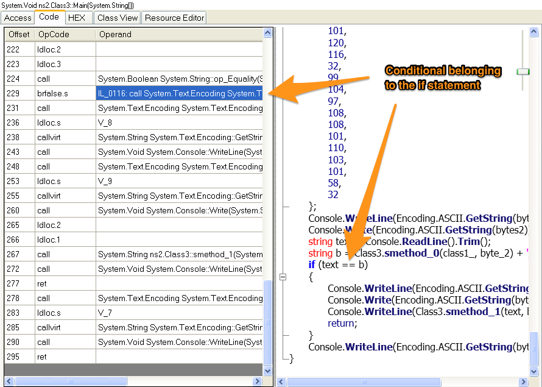

# Flare-On Challenge #7
#### By: Sage

Oddly, this challenge was easier than some of the previous ones. I'll show you two different ways of solving it. When you use PE scanners like ExeInfo PE you find out that the program was written in .Net and that it has been obfuscated/encrypted. Furthermore, CFF Explorer is showing strings containing SmartAssembly. SmartAssembly is used to protect .Net code. These things are illustrated in the image below.


So the first idea that pops into your head is use [de4dot](http://de4dot.com/) to remove the protection. Running de4dot is simple, you just drag and drop the program onto the de4dot icon. It will create a file named YUSoMeta-cleaned.exe.


Now we should run the program to ensure it still runs. The program still runs and it displays a message warning you that the program is 100% tamperproof. So it is time to start looking at the code. I would suggest using [Graywolf](http://www.digitalbodyguard.com/graywolf.html) because even though it says it is tamperproof we should still put that to the test.

When Graywolf first opens it will ask if you want to process the file with de4dot, click no. It is better to manually use de4dot as we did earlier. Doing it manully ensures you are using the latest version against executables. Now navigate to ns2.Class3 to see the Main method. In a nutshell the Main method shows that it does the following:
- Writes to the console
- Prompts you
- Calculates the value your input will be checked against
- Lastly, if your input was correct it shows you the goodboy message; otherwise you get the badboy message.

This has all been illustrated below.


The function smethod\_0 takes in a 21 byte array and does an XOR operation 21 times against a string from smethod\_2. The function smethod\_2 gets its information from currently running IL instructions. So the reason we can't alter the executable is becoming clear; parts of the code references the executable itself to ensure there is no tampering. The other thing that is clear is that the return value from smethod\_0 is 21 bytes long.

After the use of smethod\_0 there is an underscore and a concatenation with smethod\_3. The function smethod\_3 computes an MD5 hash. How long is an MD5 hash? 128 bits, or 16 bytes, usually represented as a 32 nibble ascii character string.

We learned valuable reconnaissance from reading the code because now we have a fingerprint of our target. The format of what we need to enter will be akin to this string, "AAAAAAAAAAAAAAAAAAAAA\_BBBBBBBBBBBBBBBBBBBBBBBBBBBBBBBBBBB"; where the A's are some program-specific string and the B's are an MD5 hash. This string has to be somewhere in memory we just need to find it.

There is something that will be very important later on regardless of which solution you choose. GrayWolf shows you the IL code and the .Net code side-by-side, so looking at them you already know what the if statement will look like in IL code. The below image is annotated for further clarity.



This brfalse.s instruction with the String::op\_Equality will serve as a sort of landmark so you know you are looking in the right place.

##Solution 1: Using DILE and Bintext
[Dotnet IL Editor (DILE)](http://sourceforge.net/projects/dile/) allows for the disassembling and debugging of .Net applications.

Run YUSoMeta.exe on the CLI and then attach to the process with DILE so you can debug the instructions. Say yes to any assemblies it needs to load. The reason we chose YUSoMeta.exe instead of YUSoMeta-cleaned.exe is because the deobfuscated version has changes made to the metadata which will cause the executable to run improperly.

Now next our goal is to find that brfalse.s instruction we talked about earlier. The following operations will get you there:

1. Pause the debuggee
2. Type in whatever you want as a correct password
3. Press F10 once to single step
4. You will notice that you are in some System.IO code. Press F12 five times to finish the ReadLine function and return back to the Main method.
5. Now you can see the branch statement. We are in the obfuscated version of the code making it hard to recognize. The picture below shows where you are now and where you need to go.

6. Press F10 six times. All the methods used to create the string we talked about earlier must have been run by this point because we are at the if statement.
7. At this point go to File -> Save memory dump... and save a dump file with the default options.

The last thing we need to do is rummage through the dump with Bintext to find our string. The length of the string we are looking for should be &gt;50 but &lt;60 since 21+1+32 = 54. Alter the "Min text length" and "Max text length" under the filter tab to speed things up. After that scroll a bit and you will see that the string you need to enter is metaprogrammingisherd\_DD9BE1704C690FB422F1509A46ABC988. Once you do that the program spits out the email address, Justr3adth3sourc3@flare-on.com.

##Solution 2: Using Windbg
Since .Net works similar to Java, it uses a JIT compiler. Using Windbg we can see the assembly produced and set breakpoints.

1. Attach Windbg to YUSoMeta.exe. (Fixing the symbol file path is optional. This will not take long and you will likely not need it.)
2. Type whatever you want as a password and press enter.
3. Run `.loadby sos clr` so we get .Net debugging extensions and `.prefer_dml 1` so we get hyperlinks that make our life easier.
4. If you type `!threads` you will see there are multiple threads. Type `~0s` so you are dealing with the first one.
5. Type `!CLRStack` and click on the hyperlink pertaining to Main. I have outlined it in the image below. How do we know it is Main? It takes in a System.String[] and calls ReadLine() among other giveaways.

6. Now that we can see the assembly generated by the JIT compiler for main we could sit here and determine where the if statement is that we talked about earlier; but there is a better way. Set a breakpoint at the address of the nop instruction you see a few lines before the function epilogue. After all, when execution gets there the string we want must be in memory somewhere.
7. Continue and when you hit the breakpoint type `!DumpHeap -strings`

Once you look through those strings you will see the following record.

```       1          136 "metaprogrammingisherd_DD9BE1704C690FB422F1509A46ABC988"```

Just like in the previous solution, enter that string into the program's prompt and it will output the email address, Justr3adth3sourc3@flare-on.com.
